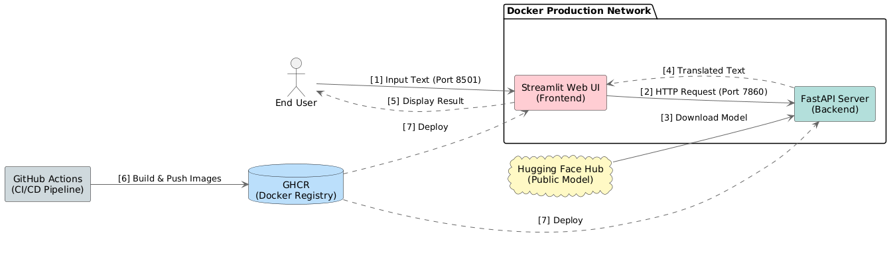
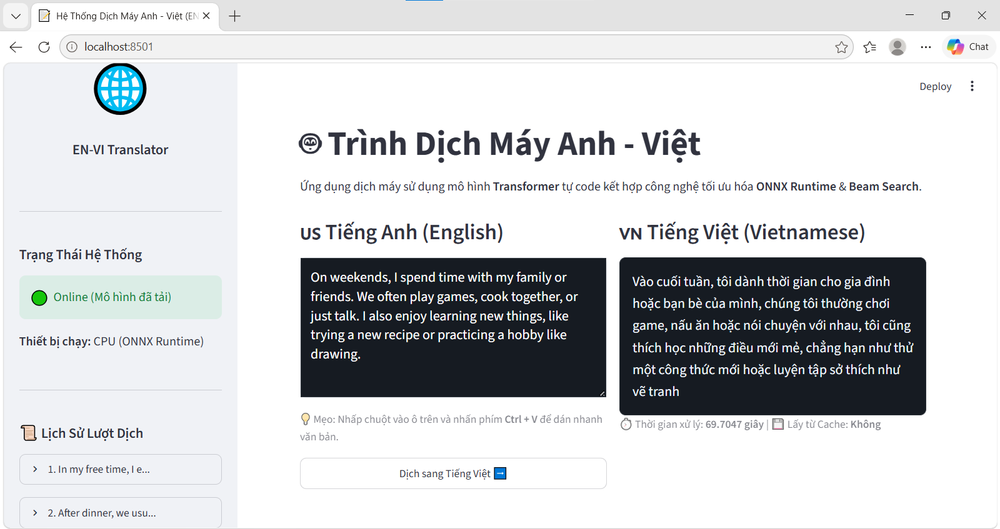

# 🌍 EN-VI Machine Translation System

[](#)
[](#)
[](#)
[](#)
[](#)
[](#)
[](#)
[](#)

A production-ready English-to-Vietnamese Machine Translation system powered by a **custom-trained Sequence-to-Sequence Transformer** model and built with MLOps best practices. This project demonstrates a complete end-to-end machine learning lifecycle, from custom model training on parallel datasets to high-performance serving and continuous deployment, utilizing Microservices architecture.

---

## 🏗️ Data flow diagram



### 📸 Application Demo


## 🚀 Key Features
- **Custom Sequence-to-Sequence Transformer**: Built with 6 Encoder/Decoder layers, 8 Attention Heads, GELU activations, Weight Tying (Tied Embeddings), and Pre-LN architecture, trained from scratch specifically for English-to-Vietnamese translation.
- **Hugging Face Hub Integration**: Automated model distribution pipeline pulling the custom-trained ONNX model weights and SentencePiece tokenizers directly from the Hugging Face repository (`nddttt/en-vi-translation-model`).
- **High-Performance Vectorized Inference**: Optimized **ONNX (Open Neural Network Exchange)** serving with fully vectorized Batch Beam Search (width=5) and Length Penalty ($\alpha=0.8$).
- **Smart In-Memory Caching**: FastAPI backend equipped with `TTLCache` (maxsize=2000 items, 24h TTL) to prevent memory leaks while accelerating response times for repeated translations.
- **Microservices Architecture**: Decoupled FastAPI backend (for ONNX model inference) and Streamlit frontend (user UI) for independent scaling and maintenance.
- **Fault-tolerant Networking**: Advanced retry mechanisms, robust JSON error handling, and Docker-based DNS resolution between services.
- **Full CI/CD Automation**: Zero-touch testing, linting, and Docker image delivery via GitHub Actions.

## 🧠 Core Machine Learning Model
This system is powered by a custom-trained neural machine translation model, specifically optimized for the English-Vietnamese language pair.

### Model Architecture
- **Core Architecture**: Sequence-to-Sequence **Transformer** with Pre-Layer Normalization for fast convergence and stable gradients.
- **Advanced Techniques**:
  - **GELU Activation**: Uses Gaussian Error Linear Unit (GELU) in the Feed-Forward Network for smoother non-linear mapping compared to standard ReLU.
  - **Weight Tying (Tied Embeddings)**: Shares weight matrices between the target decoder embeddings and final linear projection layer (with trainable output bias), reducing model parameters and improving semantic embedding quality.
- **Hyperparameters**:
  - **Encoder/Decoder Layers**: 6 layers each
  - **Attention Heads**: 8 heads
  - **Embedding Dimension ($d_{model}$)**: 512
  - **Feed-Forward Dimension ($d_{ff}$)**: 3072
  - **Dropout Rate**: 0.15
  - **Max Sequence Length**: 100 tokens (padded dynamically using bucket boundaries `[15, 25, 35, 50, 65, 80, 105]` to eliminate memory leakage/OOM on GPU).
  - **Optimizer**: Adam with custom learning rate schedule (25,000 warmup steps).
  - **Loss Function**: Masked Cross-Entropy with **Label Smoothing ($\epsilon = 0.1$)**.
- **Model Components & Code Structure**:
  - **Positional Encoding (`layers.py`)**: Implements positional embeddings to incorporate sequence order details.
  - **Multi-Head Attention (`attention.py`)**: Core mechanism managing self-attention and cross-attention over 8 split heads.
  - **Encoder Stack (`encoder.py`)**: Stack of 6 Encoder layers incorporating Pre-Layer Normalization and residual connections for training stability.
  - **Decoder Stack (`decoder.py`)**: Stack of 6 Decoder layers with masked self-attention (to prevent future token leakage) and cross-attention over the encoder's output.
  - **Model Wrapper (`transformer.py`)**: Integrates Encoder/Decoder blocks with Tied Embeddings and output projection bias into a single end-to-end model.
- **Export Format**: Exported to **ONNX** format with dynamic tensor shapes `[None, None]` for both encoder and decoder inputs. This drastically reduces model size and significantly boosts CPU/GPU inference speed compared to native TensorFlow serving.

### Dataset & Preprocessing
- **Training Data**: Trained on the public **PhoMT** dataset (`ura-hcmut/PhoMT` from Hugging Face Datasets), a high-quality, large-scale English-Vietnamese parallel corpus.
- **Data Size**:
  - **Raw Corpus**: 400,000 parallel sentence pairs.
  - **Filtered TFRecord**: High-yield parallel training pairs after excluding sentences exceeding `max_length = 100`.
- **Tokenization**: Subword tokenization using **SentencePiece** (Unigram model, vocabulary size of **16,000** for both English and Vietnamese) to handle out-of-vocabulary (OOV) words and complex Vietnamese syntax effectively.

### Performance & Evaluation
- **Translation Quality (BLEU Scores)**: Evaluated using **Vectorized Batch Beam Search Decoding** (beam_width=5, len_penalty_alpha=0.8, evaluated in `evaluate.ipynb`):
    - **BLEU-4 (12,000 test sentences)**: **19.07** / 100 (Full PhoMT Test Set evaluation)
    - **BLEU-4 (600 validation sentences)**: **20.72** / 100 (Grid Search Optimal Peak)
    - **BLEU-1 / BLEU-2 (12,000 test sentences)**: **52.58** / **36.21**
- **Inference Speed**: Highly optimized generation using parallel Batch Beam Search (Width=5, Length Penalty $\alpha = 0.8$), achieving real-time translation with average latency of `< 200ms` per sentence on a standard CPU (running via ONNX Runtime in production) and less than 15 seconds for an entire batch of 64 sentences on GPU.

## 📂 Directory Structure

```text
.
├── .github/workflows/       # CI/CD Automation Scripts
│   ├── ci.yml               # Linter, Test & Build check
│   └── cd.yml               # Publish Images to GHCR
├── assets/                  # Documentation Images
├── backend/                 # FastAPI Inference Service
│   ├── app/                 # Backend Source Code (Python)
│   ├── config.yaml          # Backend Configuration
│   ├── requirements.txt     # Backend Dependencies (with cachetools)
│   └── Dockerfile           # Backend Container Config
├── frontend/                # Streamlit Web UI Service
│   ├── app.py               # Streamlit Main UI Code
│   ├── api_client.py        # Backend Connection Client
│   ├── config.yaml          # Frontend Configuration
│   ├── requirements.txt     # Frontend Dependencies
│   └── Dockerfile           # Frontend Container Config
├── tests/                   # Automated Unit Tests
│   ├── test_backend.py      # FastAPI Health Checks
│   └── test_frontend.py     # Config & Logic Checks
├── training_environment/    # Model Training Scripts & Notebooks
├── docker-compose.yml       # Docker Services Orchestration
├── requirements-test.txt    # Testing Dependencies
└── README.md                # Project Documentation
```

## ⚙️ How to Run (Local Development)

### Prerequisites
- **Docker** and **Docker Compose** installed on your host machine.

### Option 1: Build & Run from Source Code (Development)
Clone this repository and run the orchestration command. The system will automatically build the images, download the custom-trained model, and wire up the internal network.

```bash
git clone https://github.com/your-username/en_vi_translation_system.git
cd en_vi_translation_system
docker-compose up -d --build
```

### Option 2: Run with Existing Images (Production/Fast Start)
If you already have the Docker images built locally, you can skip the time-consuming build process by dropping the `--build` flag:
```bash
docker-compose up -d
```
*(To run the app directly from the published GHCR images without downloading the source code, simply create a network and run the containers):*
```bash
docker network create mlops_network
docker run -d --name backend --network mlops_network -p 8000:7860 ghcr.io/tuan0306/en_vi_translation_system/en-vi-backend:latest
docker run -d --name frontend --network mlops_network -p 8501:7860 -e BACKEND_API_URL=http://backend:7860 ghcr.io/tuan0306/en_vi_translation_system/en-vi-frontend:latest
```

### 🌐 Access Points
- **Web Interface (Streamlit):** `http://localhost:8501`
- **API Documentation (FastAPI Swagger):** `http://localhost:8000/docs`

## 🛡️ DevOps & CI/CD Highlights

### 1. Configuration Management (Plug-and-Play)
No `.env` files or secret tokens are required to run this project! 
The custom-trained model is hosted on Hugging Face, and application constants are securely managed via `config.yaml` files. Environment variables are seamlessly utilized by `docker-compose` to override local configs during container orchestration, ensuring maximum flexibility.

### 2. CI Pipeline (Continuous Integration)
Every push to the repository triggers a strict CI pipeline:
1. **Flake8**: Enforces PEP8 coding standards (smartly ignoring heavy training environments via sparse-checkout).
2. **Pytest**: Validates API Health Check and Frontend configuration logic.
3. **Docker Build**: Verifies that both microservices compile successfully in a clean environment.

### 3. CD Pipeline (Continuous Delivery)
Upon successful CI completion (`workflow_run`), the CD pipeline takes over:
- Authenticates with **GitHub Container Registry (GHCR)**.
- Builds and tags production-ready Docker images.
- Pushes the artifacts to the cloud, allowing end-users to pull and run the system instantly without compiling source code.
